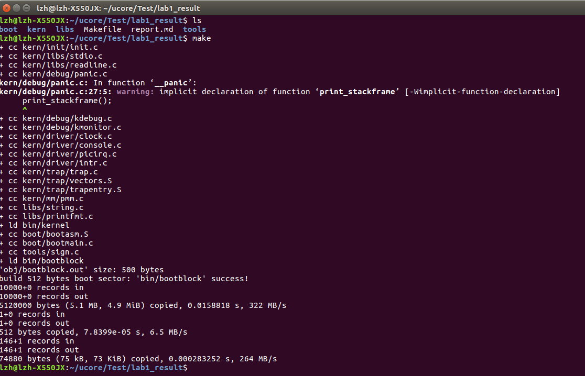
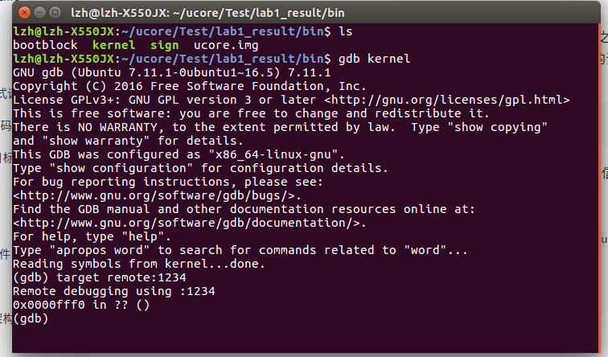
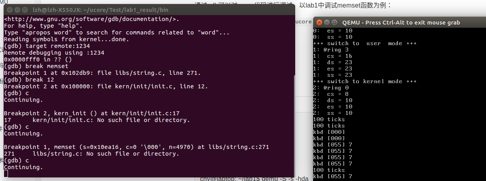
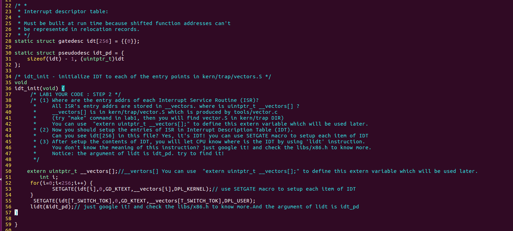
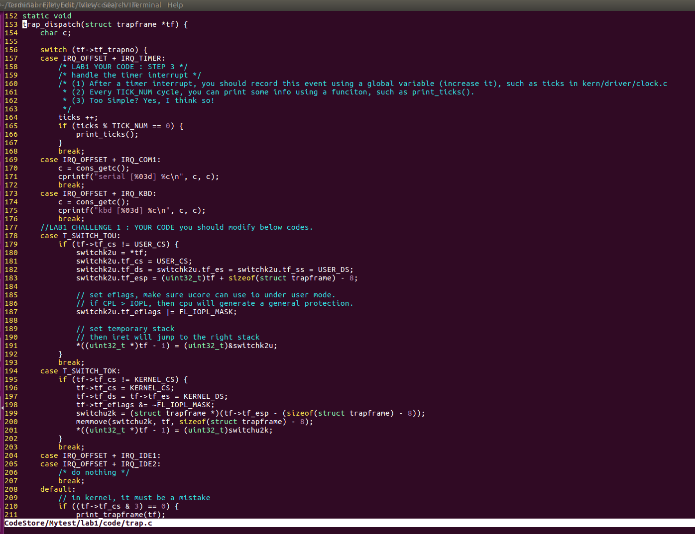

1. #### 在shell下调试lab1_result下ucore过程

在/lab1_result下运行make



在lab1_result下运行qemu-system-i386 -S -s -hda ./bin/ucore.img -monitor stdio

可以打开qemu

ng)

qemu中的CPU并不会马上开始执行，这时我们启动gdb，然后在gdb命令行界面下，使用下面的命令连接到qemu：



Target remote:1234

然后测试一下memset,并在12打一个断点，此时qemu出现booting from hard disk...


继续运行c，直到qemu模拟器出现100triks

/Selection_024.png)

2. #### 练习3

   BIOS将通过读取硬盘主引导扇区到内存，并转跳到对应内存中的位置执行bootloader。请分析bootloader是如何完成从实模式进入保护模式的。

   提示：需要阅读**小节“保护模式和分段机制”**和lab1/boot/bootasm.S源码，了解如何从实模式切换到保护模式，需要了解：

   - 为何开启A20，以及如何开启A20
   - 如何初始化GDT表
   - 如何使能和进入保护模式

   分析bootloader 进入保护模式的过程。

   从`%cs=0 $pc=0x7c00`，进入后

   首先清理环境：包括将flag置0和将段寄存器置0
   ```c++
   	.code16
   	    cli
   	    cld
   	    xorw %ax, %ax
   	    movw %ax, %ds
   	    movw %ax, %es
   	    movw %ax, %ss
   ```

   开启A20：通过将键盘控制器上的A20线置于高电位，全部32条地址线可用，
   可以访问4G的内存空间。

   ```c++
   	seta20.1:               # 等待8042键盘控制器不忙
   	    inb $0x64, %al      # 
   	    testb $0x2, %al     #
   	    jnz seta20.1        #
   	
   	    movb $0xd1, %al     # 发送写8042输出端口的指令
   	    outb %al, $0x64     #
   	
   	seta20.1:               # 等待8042键盘控制器不忙
   	    inb $0x64, %al      # 
   	    testb $0x2, %al     #
   	    jnz seta20.1        #
   	
   	    movb $0xdf, %al     # 打开A20
   	    outb %al, $0x60     # 
   ```

   初始化GDT表：一个简单的GDT表和其描述符已经静态储存在引导区中，载入即可
   ```c++
   	    lgdt gdtdesc
   ```

   进入保护模式：通过将cr0寄存器PE位置1便开启了保护模式
   ```c++
   	    movl %cr0, %eax
   	    orl $CR0_PE_ON, %eax
   	    movl %eax, %cr0
   ```

   通过长跳转更新cs的基地址
   ```c++
   	 ljmp $PROT_MODE_CSEG, $protcseg
   	.code32
   	protcseg:
   ```

   设置段寄存器，并建立堆栈
   ```c++
   	    movw $PROT_MODE_DSEG, %ax
   	    movw %ax, %ds
   	    movw %ax, %es
   	    movw %ax, %fs
   	    movw %ax, %gs
   	    movw %ax, %ss
   	    movl $0x0, %ebp
   	    movl $start, %esp
   ```
   转到保护模式完成，进入boot主方法
   ```c++
   	    call bootmain
   ```

3. #### 练习6：完善中断初始化和处理 （需要编程）

   请完成编码工作和回答如下问题：

   1. 中断描述符表（也可简称为保护模式下的中断向量表）中一个表项占多少字节？其中哪几位代表中断处理代码的入口？
   2. 请编程完善kern/trap/trap.c中对中断向量表进行初始化的函数idt_init。在idt_init函数中，依次对所有中断入口进行初始化。使用mmu.h中的SETGATE宏，填充idt数组内容。每个中断的入口由tools/vectors.c生成，使用trap.c中声明的vectors数组即可。
   3. 请编程完善trap.c中的中断处理函数trap，在对时钟中断进行处理的部分填写trap函数中处理时钟中断的部分，使操作系统每遇到100次时钟中断后，调用print_ticks子程序，向屏幕上打印一行文字”100 ticks”。

   > 【注意】除了系统调用中断(T_SYSCALL)使用陷阱门描述符且权限为用户态权限以外，其它中断均使用特权级(DPL)为０的中断门描述符，权限为内核态权限；而ucore的应用程序处于特权级３，需要采用｀int 0x80`指令操作（这种方式称为软中断，软件中断，Tra中断，在lab5会碰到）来发出系统调用请求，并要能实现从特权级３到特权级０的转换，所以系统调用中断(T_SYSCALL)所对应的中断门描述符中的特权级（DPL）需要设置为３。

   要求完成问题2和问题3 提出的相关函数实现，提交改进后的源代码包（可以编译执行），并在实验报告中简要说明实现过程，并写出对问题1的回答。完成这问题2和3要求的部分代码后，运行整个系统，可以看到大约每1秒会输出一次”100 ticks”，而按下的键也会在屏幕上显示。

   提示：可阅读小节“中断与异常”。 

   **A1:中断向量表一个表项占用8字节，其中2-3字节是段选择子，0-1字节和6-7字节拼成位移，
   两者联合便是中断处理程序的入口地址。**

   **A2（1）每个中断服务套路（ISR）的入口地址在哪里？**
   **所有ISR的都存储在__vectors中。__**

   **__vectors []在kern / trap / vector.S中，由tools / vector.c生成**

   （在lab1中尝试“make”命令，在kern / trap DIR中找到vector.S）
   使用“extern uintptr_t __vectors [];” 定义将在以后使用的外部变量。

   （2）在中断描述表（IDT）中设置ISR的条目。
   idt [256]是IDT,使用SETGATE宏来设置IDT的每个项目

   （3）设置IDT的内容后，通过“lidt”指令让CPU知道IDT在哪里。
   你不知道这条指令的意思吗？ 只是谷歌吧！ 并检查libs / x86.h以了解更多信息。

   注意：lidt的参数是idt_pd。 试着找到它！

   

   **A3: 处理定时器中断**
   ​         **（1）定时器中断后，使用全局变量（增加它）记录这个事件，比如kern / driver / clock.c中的ticks**

   ​        **（2）每个TICK_NUM循环，您可以使用函数打印一些信息，例如print_ticks()**




#### 4.实验小结

了解了几种调试命令。


