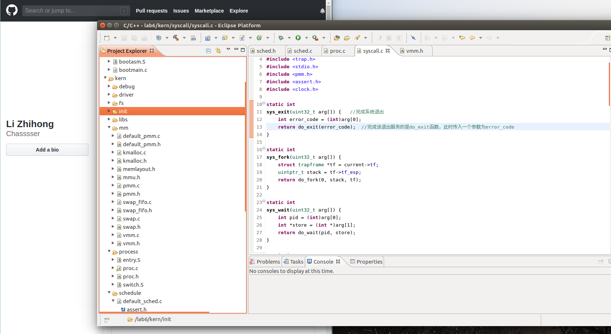

## 实验目的

- 了解第一个用户进程创建过程
- 了解系统调用框架的实现机制
- 了解ucore如何实现系统调用sys_fork/sys_exec/sys_exit/sys_wait来进行进程管理
- 理解操作系统的调度管理机制
- 熟悉 ucore 的系统调度器框架，以及缺省的Round-Robin 调度算法
- 基于调度器框架实现一个(Stride Scheduling)调度算法来替换缺省的调度算法

## 实验内容

#### 1.lab5练习3: 阅读分析源代码，理解进程执行 fork/exec/wait/exit 的实现，以及系统调用的实现（不需要编码）

请在实验报告中简要说明你对 fork/exec/wait/exit函数的分析。并回答如下问题：

- 请分析fork/exec/wait/exit在实现中是如何影响进程的执行状态的？
- 请给出ucore中一个用户态进程的执行状态生命周期图（包执行状态，执行状态之间的变换关系，以及产生变换的事件或函数调用）。（字符方式画即可）

执行：make grade。如果所显示的应用程序检测都输出ok，则基本正确。（使用的是qemu-1.0.1）

#### 2.lab6练习1: 使用 Round Robin 调度算法（不需要编码）

完成练习0后，建议大家比较一下（可用kdiff3等文件比较软件）个人完成的lab5和练习0完成后的刚修改的lab6之间的区别，分析了解lab6采用RR调度算法后的执行过程。执行make grade，大部分测试用例应该通过。但执行priority.c应该过不去。

请在实验报告中完成：

- 请理解并分析sched_calss中各个函数指针的用法，并接合Round Robin 调度算法描ucore的调度执行过程
- 请在实验报告中简要说明如何设计实现”多级反馈队列调度算法“，给出概要设计，鼓励给出详细设计

## 实验步骤

### lab5练习3

首先，找到函数所在位置



#### **(1)现在，分析sys_exit函数的功能**


所以这里实际完成process exit的是do_exit函数，在proc.c下查看do_exit函数


**然后添加注释，分析其功能.**

**可以发现，sys_exit就是执行退出操作，释放进程占用的资源。由于进程本身要做回收，所以要存在来执行这个操作，导致进程存在的PCB和内核栈空间不能释放，所以需要父进程来释放子进程无法完成的回收工作**


#### **(2)sys_fork函数**


同样，在proc.c中找到完成创建工作的do_fork函数


**然后添加注释，分析其功能.**

**可以看到这个就是lab2中所提到的do_fork函数，用于创建第一个内核线程initproc，同时也用于子进程的创建,它主要做了下面7件事情:**

1. 分配并初始化进程控制块（alloc_proc函数）；
2. 分配并初始化内核栈（setup_stack函数）；
3. 根据clone_flag标志复制或共享进程内存管理结构（copy_mm函数）；
4. 设置进程在内核（将来也包括用户态）正常运行和调度所需的中断帧和执行上下文（copy_thread函数）；
5. 把设置好的进程控制块放入hash_list和proc_list两个全局进程链表中；
6. 自此，进程已经准备好执行了，把进程状态设置为“就绪”态；
7. 设置返回码为子进程的id号。


#### **(3)sys_wait函数**


**找到do_wait函数，可以看出其功能是等待一个或者任何处于僵尸状态的子进程，然后释放其内核栈空间和PCB,即回收子进程的内核栈和进程控制块所占内存空间，并且只有在do_wait之后，子进程的所有资源才能被释放**

**添加注释**


#### **(4)sys_exec函数**


**通过do_execve函数来完成用户进程的创建工作，首先清空用户态空间为加载新的代码做准备，然后加载程序执行码到当前进程创建的用户态虚拟空间中。**

**添加注释**


#### (5)用户进程执行转换图

一开始new出来的进程，此时系统刚创建了PCB,即调用了alloc_proc函数，由于资源为准备好，所以处于PROC_UNINIT状态，接着把进程执行所需要的东西准备好了，则可以将其放入就绪队列中，则处于PROC_RUNNABLE状态，如果这个进程被选中 ，就可以进入RUNNING状态，此时的进程可能会遇到3种事件而改变状态：

1.需要某些正在被使用的内存空间，或者主动睡眠，都会进入 PROC_SLEEPING 状态，等待着被重新唤醒

2:进程运行结束 ，进入退出状态，即PROC_ZOMBIE状态，等待其父进程来进行回收工作

3:在一个时间片内还没有运行完成，优先级降低，从运行状态转换成就绪状态，即PROC_RUNNABLE，等待下一次被系统选中。

```c++
------------------------------
process state       :     meaning               -- reason
    PROC_UNINIT     :   uninitialized           -- alloc_proc
    PROC_SLEEPING   :   sleeping                -- try_free_pages, do_wait, do_sleep
    PROC_RUNNABLE   :   runnable(maybe running) -- proc_init, wakeup_proc, 
    PROC_ZOMBIE     :   almost dead             -- do_exit

-----------------------------

```


### lab6练习1

#### **(1)找到sched_class结构**


**schedule函数完成了与调度框架和调度算法相关三件事情:把当前继续占用CPU执行的运行进程放放入到就绪进程队列中，从就绪进程队列中选择一个“合适”就绪进程，把这个“合适”的就绪进程从就绪进程队列中摘除。**


**查看proc_run函数,这个和lab4中涉及到了，即调度并执行第一个内核线程initproc的时候**


**RR_sched_class的调度策略类**


#### **(2)RR调度算法：**

**RR调度算法就是让所有处于runnable态的进程轮流使用CPU,此时使用一个双向链表来维护就绪队列，在每个计时器到0的时候，就递减当前所执行的进程的时间片。所以如果当前进程的时间片为0了，就说明这个进程在一个时间片内还没有运行完(或者说已经运行一个时间片了),此时就需要把CPU的使用权转让给其他的进程。具体而言，就是把这个时间片已经为0的进程(未执行完)插入到就绪队列的末尾，同时将其时间片恢复为一个完整时间片的大小，然后再从所维护的就绪队列的头部取出下一个进程，让其使用CPU.**

**然后查看其具体函数**


##### (2-1)RR_enqueue函数：

将上一个在一个时间片内还没有运行完的进程插入到就绪队列的末尾，然后重置其时间片大小


##### **(2-2)RR_pick_next函数:**

**取出就绪队列rg的队首元素，然后通过le2proc函数将其转换**


le2proc函数:将le转换为proc_struct指针


##### (2-3)RR_proc_tick函数

即每次timer到时后，trap函数将会间接调用此函数来把当前执行进程的时间片time_slice减一。如果time_slice降到零，则设置此进程成员变量need_resched标识为1，这样在下一次中断来后执行trap函数时，会由于当前进程程成员变量need_resched标识为1而执行schedule函数，从而把当前执行进程放回就绪队列末尾，而从就绪队列头取出在就绪队列上等待时间最久的那个就绪进程执行。


##### **(2-4)RR_dequeue函数:**

**把就绪进程队列rq的进程控制块指针的队列元素删除，并把表示就绪进程个数的proc_num减一**


##### 关于多级调度的思路:

**放N个队列，最后一个是RR调度，前面都是FCFS(先来先服务)队列。具体而言，这N个队列优先级从上到下递减，队列规定的执行时间从上倒下也是递减的，对于同一个队列，作业优先级从高到低。当有M个进程处于PROC_RUNNABLE状态的时候，先依次放入第一个队列中，如果在这个队列规定时间内没有跑完，就放入第二个队列中，同样，从第i个队列放入第i+1个队列中，直到放入最后RR队列中。**

## 实验小结

1.RR调度算法的调度思想就是让所有runnable态的进程分时轮流使用CPU时间，当前进程的时间片用完之后，就将当前进程放置到运行队列的尾部，再从其头部取出进程进行调度。

2.刚创建好的用户进程不能马上就开始执行，因为此时只是创建了PCB，但是其他比如进程所需奥的虚拟内存空间，以及所需要加载进来执行的代码都没有准备好。等上述东西准备完成之后，程序就处于RUNNING状态了，可以进入就绪队列来等待系统的调度。